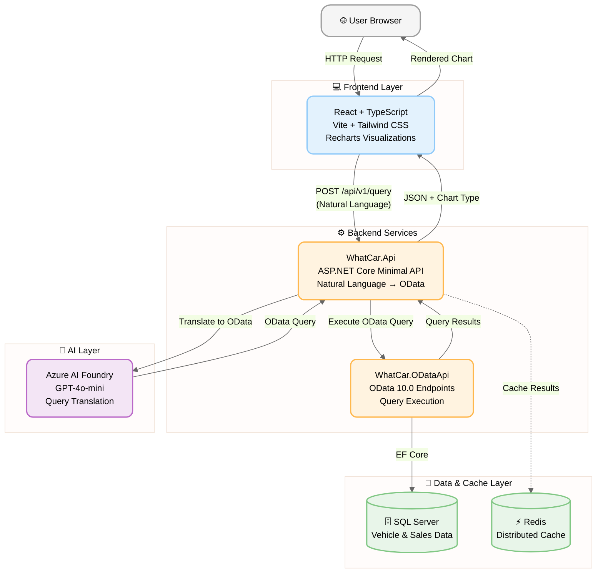

# UK Vehicle Sales Analytics

Proof-of-concept application for analyzing UK vehicle registration data through natural language queries and intelligent visualizations.

## What is this?

This application democratizes access to UK vehicle registration data, enabling anyone—journalists, researchers, car buyers, policy makers—to discover trends through conversational queries without technical expertise.

**Key Features:**

- 💬 **Natural Language Queries** - Ask questions in plain English (e.g., "What were the top-selling EVs in 2024?")
- 📊 **Smart Visualizations** - Auto-detecting charts (trends, comparisons, rankings, tables)
- ⚡ **Real-time Analysis** - Query translation via GPT-4o-mini deployed to Azure AI Foundry
- 🎯 **UK Vehicle Data** - Quarterly registration data by Make, Model, Fuel type from official sources

## Architecture



## Technology Stack

- **Frontend**: React 19 + TypeScript + Vite + Tailwind CSS 4.x
- **Backend**: ASP.NET Core 10 Minimal API
- **AI**: GPT-4o-mini (Azure AI Foundry)
- **Data**: SQL Server (UK vehicle registration data)
- **Cache**: Redis (distributed caching)
- **Orchestration**: .NET Aspire (local development)

## Data Flow

1. **User Query** → User types natural language question in chat interface
2. **AI Translation** → GPT-4o-mini translates to OData query with schema context
3. **Query Execution** → OData API executes against SQL Server
4. **Result Processing** → API detects appropriate chart type (trend/comparison/ranking/table)
5. **Visualization** → Frontend renders interactive chart with Recharts

## Getting Started

### Prerequisites

- [.NET 10.0 SDK](https://dotnet.microsoft.com/download/dotnet/10.0)
- [Node.js](https://nodejs.org/) (LTS version recommended)
- [Docker](https://www.docker.com/get-started) (for SQL Server, Redis)
- Azure AI Foundry deployment (GPT-4o-mini)

### Configuration

1. **Azure AI Foundry Setup**:

   - Create Azure AI Foundry resource
   - Deploy GPT-4o-mini model
   - Note endpoint URL and API key

2. **App Configuration** (`backend/WhatCar.Api/appsettings.Development.json`):

   ```json
   {
     "Llm": {
       "Endpoint": "https://your-foundry-resource.openai.azure.com",
       "ApiKey": "your-api-key",
       "Model": "gpt-4o-mini"
     }
   }
   ```

3. **Database Setup**:
   - SQL Server connection string configured via Aspire
   - CSV data ingestion: Run `tools/CsvIngestor.cs` with `data/df_VEH0120_GB.csv`

### Running Locally

Using .NET Aspire (recommended):

```bash
cd backend/WhatCar.AppHost
dotnet run
```

This automatically starts:

- SQL Server (container)
- Redis (container)
- WhatCar.ODataApi (OData service)
- WhatCar.Api (Natural language API)
- Frontend dev server (Vite)

Access the Aspire dashboard at `http://localhost:15000` to monitor all services.

### Manual Run (without Aspire)

**Backend**:

```bash
cd backend/WhatCar.Api
dotnet run
```

**Frontend**:

```bash
cd frontend
npm install
npm run dev
```

## Example Queries

Try these natural language queries:

- "What were the top 5 selling vehicles in 2023?"
- "Show me electric vehicle trends from 2020 to 2024"
- "Compare Tesla vs BMW sales in 2024"
- "Which manufacturers had the highest sales growth in Q3 2024?"
- "Show me diesel vs petrol adoption over the last 5 years"

## Project Structure

```
what-car/
├── backend/
│   ├── WhatCar.Api/              # Natural language query API
│   ├── WhatCar.ODataApi/          # OData query execution service
│   ├── WhatCar.ODataCore/         # Shared data models & DbContext
│   ├── WhatCar.AppHost/           # .NET Aspire orchestration
│   └── WhatCar.ServiceDefaults/   # Shared service configuration
├── frontend/                      # React + TypeScript UI
├── data/                          # CSV datasets
├── tools/                         # Data ingestion utilities
└── .specify/                      # SpecKit governance docs
```

## Data Sources

- **UK Vehicle Registration Data** (quarterly CSV)
  - Makes, Models, Fuel types (Petrol, Diesel, Electric, Hybrid, etc.)
  - Years: 1994-2024 (Q3)
  - Quarterly unit sales by vehicle

**Note**: This is a PoC with limited dataset. Production would require:

- Vehicle specifications (power, engine size, price)
- Real-time data updates
- Historical enrichment

## Performance Characteristics

- **Simple queries** (filter, sort): <200ms
- **Complex aggregations** (multi-table joins, groupby): <10s
- **Page load**: <2s on 3G connection
- **Resilience**: 90s attempt timeout, 120s total timeout, circuit breaker for repeated failures

## Limitations (Current PoC)

- ❌ No authentication/authorization
- ❌ No saved queries or user preferences
- ❌ No vehicle recommendation algorithm (requires specifications data)
- ❌ No prediction/forecasting (planned for future)
- ❌ No CSV export (planned)
- ❌ Limited to available dataset columns (no PowerKW, PriceSegment, etc.)

## Deployment

Production deployment targets:

- **Azure App Service** (Web Apps) for hosting
- **Azure SQL Database** for data storage
- **Azure Redis Cache** for distributed caching
- **Azure AI Foundry** for GPT-4o-mini
- **GitHub Actions** for CI/CD

Deployment scripts coming soon (Bicep/Terraform).

## Contributing

This is a proof-of-concept project. Contributions welcome for:

- Additional chart types
- Query optimization
- UI/UX improvements
- Data quality enhancements

## License

MIT License - see LICENSE file for details

## Governance

All architectural and business decisions are governed by:

- `.specify/memory/constitution.md` - Core principles and non-negotiables
- `.specify/spec.md` - User stories and functional requirements
- `.specify/plan.md` - Implementation phases
- `.specify/tasks.md` - Detailed task breakdown
